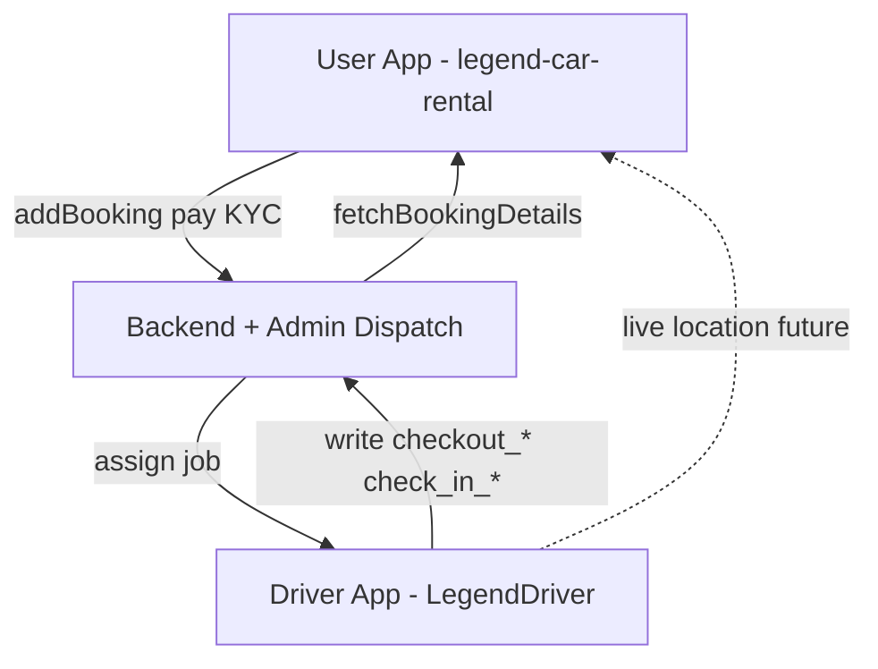
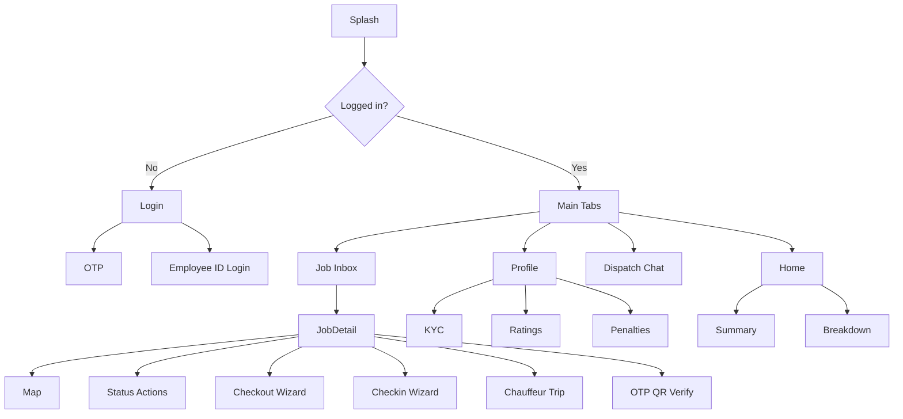

# Legend Driver App — Build Specification

> **Project:** `/Users/farjaanpatel/LegendDriver`  
> **Companion doc:** [USER_APP_OVERVIEW.md](./USER_APP_OVERVIEW.md) (Legend Car Rental customer app)  
> **Strategy:** Build full UI/UX first with **dummy data + local placeholder images**; swap to Driver API when backend is ready.  
> **Last updated:** May 2026

---

## 1. Product goal

**Legend Driver** is the field-operations app for Legend Rent-a-Car drivers and chauffeurs. It executes what the **user app** only books and later **views**:

- Accept jobs (delivery, pickup, return/collection, chauffeur trips)
- Navigate to customer / branch
- Update job status and live location (for future “driver on the way” on user app)
- Complete vehicle **check-out** and **check-in** using the **same field names** as user `BookingDetails`
- Handle breakdown/service field updates, ops chat, ratings/penalties (driver view)

**Phase 1 rule:** No backend dependency blockers — use `src/mocks/` and static assets under `src/assets/dummy/`.

---

## 2. Relationship to user app



| Concern | User app | Driver app |
|---------|----------|------------|
| API prefix | `/User/Api/*` | `/Driver/Api/*` (planned; mock until live) |
| Handover | Read-only on Booking Overview | **Create / edit** |
| Maps | Booking-time pin picker | Job map, navigate, live share |
| Login | Customer phone OTP | Driver phone OTP **or** employee ID |
| Jobs | Bookings list | **Job inbox** with accept/reject |

---

## 3. Tech stack (target — align with user app patterns)

| Layer | Choice | Notes |
|-------|--------|-------|
| Framework | React Native **0.85+** (current scaffold) | Align tooling with user 0.82 over time |
| Language | TypeScript | Strict |
| Navigation | React Navigation 7 | Stack + tabs |
| State | Zustand | `authStore`, `jobStore`, `shiftStore`, `handoverStore` |
| API | Axios + interceptors | Mirror `legend-car-rental/src/api` structure |
| UI | React Native Paper (recommended) | Match user app feel |
| i18n | i18next | `en` + `ar`, RTL |
| Maps | `react-native-maps` | Dummy coords in Phase 1 |
| Images | Local dummy + `require()` | No CDN required for MVP |
| Notifications | `@react-native-firebase/messaging` (later) | Mock in-app notification list first |

### Environments (mirror user app)

| Env | Suggested base (future) |
|-----|-------------------------|
| development | `https://legendapi.andhera.in` |
| staging | `https://admin-portal-stg.legendrentacar.com` |
| production | `https://admin-portal.legendrentacar.com` |

Driver paths: **`/Driver/Api/...`** (not `/User/Api`).

---

## 4. MVP approach — dummy data first

### 4.1 Principles

1. Every screen must work **offline from mocks** — tap through full flows.
2. Use **realistic UAE** names, plates, addresses, AED amounts.
3. Handover forms write to **local store** then show success; later POST to API.
4. Photos: bundled assets in `src/assets/dummy/cars/`, `signatures/`, `damage/`.
5. Map: fixed region **Dubai** (25.2048, 55.2708) with 2–3 pins per job.
6. Toggle `USE_MOCK_API=true` in env to keep mocks after API exists.

### 4.2 Folder structure (target)

```
LegendDriver/
├── docs/
│   ├── USER_APP_OVERVIEW.md
│   └── DRIVER_APP_SPEC.md          ← this file
├── src/
│   ├── api/                        # services, models, interceptors (stubbed)
│   ├── assets/dummy/               # images for cars, profile, damage
│   ├── components/                 # shared UI
│   ├── config/                     # env, theme
│   ├── features/
│   │   ├── auth/
│   │   ├── onboarding/
│   │   ├── home/                   # dashboard + online toggle
│   │   ├── jobs/                   # inbox, detail, accept/reject
│   │   ├── map/                    # job map, navigation launch
│   │   ├── handover/             # checkout + checkin wizards
│   │   ├── chauffeur/              # trip timer, stops
│   │   ├── verify/               # OTP / QR handover
│   │   ├── breakdown/
│   │   ├── chat/                   # dispatch + masked contact
│   │   ├── profile/                # KYC, docs, ratings, penalties
│   │   └── notifications/
│   ├── hooks/
│   ├── i18n/locales/             # en.json, ar.json
│   ├── mocks/                      # JSON + factories
│   ├── navigation/
│   ├── store/
│   └── utils/
├── App.tsx
└── package.json
```

### 4.3 Mock data modules

| File | Contents |
|------|----------|
| `mocks/driverProfile.mock.ts` | Driver id, name, employeeId, phone, KYC status, fleet vehicles |
| `mocks/jobs.mock.ts` | 8–12 jobs across types + priorities |
| `mocks/handover.mock.ts` | Prefilled checkout/checkin samples |
| `mocks/chauffeurTrip.mock.ts` | Active trip with stops |
| `mocks/chat.mock.ts` | Dispatch thread messages |
| `mocks/notifications.mock.ts` | Push-style inbox items |
| `mocks/ratingsPenalties.mock.ts` | Weekly summary, strikes |
| `mocks/breakdown.mock.ts` | Assigned breakdown tickets |

### 4.4 Dummy images inventory

Place under `src/assets/dummy/`:

| Asset | Use |
|-------|-----|
| `car-front.jpg`, `car-back.jpg`, `car-left.jpg`, `car-right.jpg` | Handover photos |
| `car-interior.jpg` | Interior checklist |
| `damage-scratch-1.jpg`, `damage-dent-1.jpg` | Damage capture |
| `signature-sample.png` | Customer sign preview |
| `driver-avatar.png` | Profile |
| `plate-ae-dummy.png` | Optional plate graphic |

Use same images across multiple jobs to save bundle size.

---

## 5. Feature modules (must-have)

All items below are **in scope** for the driver app (user confirmed).

### A. Onboarding & profile

| # | Feature | Dummy behavior | Future API |
|---|---------|----------------|------------|
| A1 | Splash + optional onboarding slides | Static 3 slides | — |
| A2 | Login: phone OTP | Any 6-digit OTP succeeds | `POST /Driver/Api/sendLoginOTP`, `verifyLoginOTP` |
| A3 | Login: employee ID + PIN/password | `EMP-1001` / `1234` mock | `POST /Driver/Api/loginEmployee` |
| A4 | Driver KYC wizard | License, ID, selfie, fleet vehicle pick | `updateDriverDocuments` |
| A5 | Online / offline toggle | Updates `shiftStore` | `POST /Driver/Api/shiftStatus` |
| A6 | Shift start / end | Timestamp in local store | `shiftStart`, `shiftEnd` |
| A7 | Language EN / AR | i18next + RTL layout | Same as user app |

**Screens:** `LoginScreen`, `OtpScreen`, `EmployeeLoginScreen`, `KycWizardScreen`, `ProfileScreen`, `SettingsScreen`

---

### B. Job inbox (core)

| # | Feature | Dummy behavior | Future API |
|---|---------|----------------|------------|
| B1 | Assigned jobs list | Filter tabs: All, Delivery, Pickup, Return, Chauffeur | `GET /Driver/Api/jobs` |
| B2 | Job types | `delivery`, `pickup`, `return_collection`, `chauffeur` | `job_type` enum |
| B3 | Job detail | Booking ref, masked customer, vehicle, schedule | `GET /Driver/Api/jobs/:id` |
| B4 | Accept / Reject | Reject → reason modal | `POST .../accept`, `.../reject` |
| B5 | Reject reasons | `busy`, `traffic`, `vehicle_issue`, `other` | Same payload |
| B6 | Priority badges | `urgent`, `overdue_return`, `same_day` | `priority` field |

**Job detail fields (align with user booking):**

```typescript
interface DriverJob {
  job_id: string;
  job_type: 'delivery' | 'pickup' | 'return_collection' | 'chauffeur';
  priority?: 'urgent' | 'overdue_return' | 'same_day' | 'normal';
  job_status: JobStatus;
  booking_id: number;
  booking_reference: string;
  customer_name: string;
  customer_phone_masked: string;   // e.g. +971 5* *** **34
  vehicle: {
    make: string;
    model: string;
    year: number;
    plate_number: string;
    color: string;
    image?: string;                // dummy local asset
  };
  branch_name: string;
  scheduled_at: string;
  pick_up_address?: string;
  drop_off_address?: string;
  latitude: number;
  longitude: number;
  delivery_status?: 'self_pickup' | 'paid_delivery';
  notes?: string;
}
```

**Screens:** `JobInboxScreen`, `JobDetailScreen`, `RejectReasonScreen`

---

### C. Delivery & pickup execution

| # | Feature | Dummy behavior | Future API |
|---|---------|----------------|------------|
| C1 | Map: customer + branch pins | Static map, two markers | Live coords |
| C2 | Open Google / Apple Maps | `Linking.openURL` with lat/lng | — |
| C3 | Status pipeline | Buttons advance FSM | `PATCH job status` |
| C4 | Live location share | Toggle “Sharing location” + mock trail | WebSocket / periodic POST |
| C5 | OTP verify at handover | Enter `123456` or scan dummy QR | `verifyHandoverOtp` |
| C6 | QR verify | Scan screen → mock success payload | `verifyHandoverQr` |

**Job status FSM (driver-side):**

```
assigned → accepted → en_route → arrived → handover_in_progress → completed
                  ↘ rejected (terminal)
                  ↘ cancelled (from dispatch)
```

Map to user-visible “driver on the way” when status ≥ `en_route` and live share ON (future user app UI).

**Screens:** `JobMapScreen`, `JobStatusScreen`, `HandoverVerifyScreen`

---

### D. Vehicle handover — Check-out (writes `checkout_*`)

Must match user app fields exactly (see USER_APP_OVERVIEW §8).

| Step | UI | Maps to API field |
|------|-----|-------------------|
| 1 | Odometer input | `checkout_oldmeter_reading` |
| 2 | Fuel level selector (Empty / 1/4 / 1/2 / 3/4 / Full) | `checkout_fuel_level` |
| 3 | Pre-rent checklist (multi-select) | `checkout_car_checklist` |
| 4 | Existing scratches (text) | `checkout_existing_scratches` |
| 5 | Photos: front, back, left, right, interior, damage | `checkout_car_photos[]` |
| 6 | Customer digital signature pad | `checkout_customer_signed` |
| 7 | Review + Submit | POST handover checkout |

**Checklist defaults (mock):**

- Registration & insurance copy present  
- Spare tire & toolkit  
- Fuel cap / charging port  
- Clean interior  
- No warning lights on dashboard  

**Screens:** `CheckoutWizardScreen` (multi-step), `SignatureScreen`, `PhotoCaptureScreen` (dummy gallery pick)

---

### E. Return / collection — Check-in (writes `check_in_*`)

| Step | UI | Maps to API field |
|------|-----|-------------------|
| 1 | Branch drop-off confirm | `check_in_branch_location` |
| 2 | Final odometer | `check_in_final_odometer` |
| 3 | Fuel level | `check_in_fuel_level` |
| 4 | Damage list (+ cost per line) | `check_in_damages[]` |
| 5 | Traffic fines (AED) | `check_in_traffic_fines` |
| 6 | Photos + signature | `check_in_car_photos`, `check_in_customer_signed` |
| 7 | Final charges note (admin review) | `check_in_final_payable`, `check_in_total_damages` |
| 8 | Submit | POST handover checkin |

Collection jobs: user may have submitted a collection **request** — show `collection_form_summary` in job notes (mock text block).

**Screens:** `CheckinWizardScreen`, `DamageListScreen`, `CollectionSummaryScreen`

---

### F. “Book with Driver” — Chauffeur trips

| # | Feature | Dummy behavior | Future API |
|---|---------|----------------|------------|
| F1 | Trip start / end | Big CTA + timestamps | `tripStart`, `tripEnd` |
| F2 | Stops list | Pickup → stop 1 → destination → drop | `trip_stops[]` |
| F3 | Trip timer | `mm:ss` from mock start time | server sync |
| F4 | Trip distance (km) | Mock counter + manual adjust dev menu | GPS odometer |
| F5 | Policy flags | “No self-drive” info banner | config from backend |
| F6 | Misuse alert (optional) | Dev trigger mock alert | telematics hook |

**Screens:** `ChauffeurTripScreen`, `TripStopsScreen`, `TripSummaryScreen`

---

### G. Breakdown & service (field)

| # | Feature | Dummy behavior | Future API |
|---|---------|----------------|------------|
| G1 | Breakdown ticket inbox | 2 mock assigned tickets | `GET /Driver/Api/breakdownTickets` |
| G2 | Navigate to breakdown location | Same as job map | — |
| G3 | Status updates | `assigned → en_route → on_site → resolved` | PATCH status |
| G4 | Service request jobs | Read-only + field notes | Link `issue_ticket_id` from user `submitIssues` |

**Screens:** `BreakdownListScreen`, `BreakdownDetailScreen`, `ServiceJobScreen`

---

### H. Communication

| # | Feature | Dummy behavior | Future API |
|---|---------|----------------|------------|
| H1 | Masked call / SMS to customer | Show masked number; simulate dial intent | Twilio / backend proxy |
| H2 | Push notification inbox | Mock list: new job, cancel, reschedule | FCM + API |
| H3 | Ops / dispatch chat | Thread with “Dispatch-UAE” | Chat API / WebSocket |
| H4 | Daily / weekly summary | Mock stats card on home | `GET /Driver/Api/summary` |
| H5 | Customer ratings (post-trip) | List stars + comment | `GET /Driver/Api/ratings` |
| H6 | Penalties | Late, no-show, incomplete checklist | `GET /Driver/Api/penalties` |

**Screens:** `NotificationsScreen`, `DispatchChatScreen`, `SummaryScreen`, `RatingsScreen`, `PenaltiesScreen`, `ContactCustomerSheet`

---

### J. Compliance & safety (phase 2+ UI, mock now)

| # | Feature | MVP |
|---|---------|-----|
| J1 | Speed / route policy banner | Static “Drive within limit” |
| J2 | Incident report form | Local submit success |
| J3 | Document expiry reminders | Mock license expiry in 30 days |

**Screens:** `IncidentReportScreen`, `ComplianceScreen`

---

### K. Admin / dispatch (consume only)

Driver app does **not** build admin UI. It consumes:

- Auto-assigned jobs (appear in inbox)
- Manual assign (push + inbox refresh)
- Cancel / reschedule events (notification + job status update)

Mock: `mocks/dispatchEvents.mock.ts` for dev menu simulations.

---

## 6. Navigation map



### Tab bar (recommended)

| Tab | Icon | Screen |
|-----|------|--------|
| Home | home | Dashboard, online toggle, today summary |
| Jobs | list | Job inbox |
| Chat | message | Dispatch chat |
| Profile | user | Profile, KYC, settings, penalties |

---

## 7. Screen backlog (implementation order)

| Phase | Screens | Goal |
|-------|---------|------|
| **P0** | Splash, Login, OTP, Employee login, Main tabs shell | Auth + shell |
| **P1** | Job inbox, Job detail, Accept/reject, Map, Status | Core ops loop |
| **P2** | Checkout wizard, Checkin wizard, Signature, Photos | Handover parity with user fields |
| **P3** | OTP/QR verify, Live share toggle, Notifications | Trust + tracking |
| **P4** | Chauffeur trip, Timer/km, Trip summary | Chauffeur product |
| **P5** | Breakdown, Service job, Dispatch chat, Contact sheet | Support link |
| **P6** | Ratings, Penalties, Summary, KYC, Compliance, Incident | HR / compliance |
| **P7** | EN/AR pass, polish, empty states | Release ready |

---

## 8. Dummy data samples

### 8.1 Mock driver profile

```json
{
  "driver_id": "DRV-2048",
  "employee_id": "EMP-1001",
  "full_name": "Ahmed Al Mansoori",
  "phone": "+971501234567",
  "email": "ahmed.mansoori@legendrent.internal",
  "kyc_status": "approved",
  "license_expiry": "2026-11-15",
  "fleet_vehicles": [
    { "vehicle_id": "VH-8821", "plate_number": "A 12345", "make": "Toyota", "model": "Camry", "year": 2024 }
  ],
  "rating_avg": 4.7,
  "is_online": false
}
```

### 8.2 Mock jobs (excerpt)

```json
[
  {
    "job_id": "JOB-9001",
    "job_type": "delivery",
    "priority": "same_day",
    "job_status": "assigned",
    "booking_reference": "LGC-2026-44821",
    "booking_id": 44821,
    "customer_name": "Sara K.",
    "customer_phone_masked": "+971 50 *** **12",
    "vehicle": { "make": "Nissan", "model": "Altima", "year": 2023, "plate_number": "D 98765", "color": "White" },
    "branch_name": "Legend Dubai Marina",
    "scheduled_at": "2026-05-26T14:00:00+04:00",
    "pick_up_address": "Legend Dubai Marina Branch",
    "drop_off_address": "Marina Walk, Dubai Marina, Dubai",
    "latitude": 25.0805,
    "longitude": 55.1403,
    "delivery_status": "paid_delivery"
  },
  {
    "job_id": "JOB-9002",
    "job_type": "return_collection",
    "priority": "overdue_return",
    "job_status": "assigned",
    "booking_reference": "LGC-2026-44102",
    "booking_id": 44102,
    "customer_name": "Omar H.",
    "customer_phone_masked": "+971 55 *** **88",
    "vehicle": { "make": "Hyundai", "model": "Tucson", "year": 2022, "plate_number": "C 44102", "color": "Black" },
    "branch_name": "Legend Al Quoz",
    "scheduled_at": "2026-05-26T16:30:00+04:00",
    "drop_off_address": "JLT Cluster Y, Dubai",
    "latitude": 25.0697,
    "longitude": 55.1425
  },
  {
    "job_id": "JOB-9003",
    "job_type": "chauffeur",
    "priority": "urgent",
    "job_status": "accepted",
    "booking_reference": "LGC-2026-45001",
    "booking_id": 45001,
    "customer_name": "Fatima A.",
    "customer_phone_masked": "+971 52 *** **01",
    "vehicle": { "make": "Mercedes-Benz", "model": "E-Class", "year": 2024, "plate_number": "L 10001", "color": "Silver" },
    "branch_name": "Legend Downtown",
    "scheduled_at": "2026-05-26T18:00:00+04:00",
    "notes": "Book with Driver — 4 hours, 2 stops",
    "latitude": 25.1972,
    "longitude": 55.2744
  }
]
```

### 8.3 Mock checkout payload (matches user app)

```json
{
  "booking_id": 44821,
  "checkout_oldmeter_reading": 12450,
  "checkout_fuel_level": "Full",
  "checkout_car_checklist": [
    "Registration & insurance copy present",
    "Spare tire & toolkit",
    "Clean interior"
  ],
  "checkout_existing_scratches": "Minor scratch rear bumper passenger side",
  "checkout_car_photos": [
    { "image": "dummy/car-front.jpg" },
    { "image": "dummy/car-back.jpg" }
  ],
  "checkout_customer_signed": true
}
```

### 8.4 Mock check-in payload

```json
{
  "booking_id": 44102,
  "check_in_branch_location": "Legend Al Quoz",
  "check_in_final_odometer": 13102,
  "check_in_fuel_level": "1/2",
  "check_in_damages": [
    { "description": "Wheel rim curb damage — FL", "cost": 350 }
  ],
  "check_in_traffic_fines": 200,
  "check_in_total_damages": 350,
  "check_in_final_payable": "550.00",
  "check_in_car_photos": [{ "image": "dummy/damage-dent-1.jpg" }],
  "check_in_customer_signed": true
}
```

### 8.5 Mock OTP / QR

| Method | Test input | Result |
|--------|------------|--------|
| OTP | `123456` | Success |
| OTP | anything else | Error “Invalid code” |
| QR | scan `LGC-HANDOVER-44821` | Success + bind to job |

### 8.6 Mock notifications

```json
[
  { "id": "n1", "type": "new_job", "title": "New delivery assigned", "body": "LGC-2026-44821 — Marina to JBR", "read": false, "created_at": "2026-05-26T13:55:00+04:00" },
  { "id": "n2", "type": "reschedule", "title": "Job rescheduled", "body": "LGC-2026-44102 moved to 16:30", "read": false, "created_at": "2026-05-26T12:10:00+04:00" },
  { "id": "n3", "type": "cancel", "title": "Job cancelled", "body": "LGC-2026-43999 cancelled by dispatch", "read": true, "created_at": "2026-05-26T09:00:00+04:00" }
]
```

### 8.7 Mock penalties & ratings

```json
{
  "weekly_summary": {
    "jobs_completed": 18,
    "on_time_pct": 94,
    "avg_rating": 4.7,
    "earnings_note": "Payout calculated by admin"
  },
  "penalties": [
    { "id": "p1", "type": "late", "booking_reference": "LGC-2026-43001", "amount_aed": 50, "date": "2026-05-20" },
    { "id": "p2", "type": "incomplete_checklist", "booking_reference": "LGC-2026-42888", "amount_aed": 0, "note": "Warning only", "date": "2026-05-18" }
  ],
  "ratings": [
    { "booking_reference": "LGC-2026-44500", "stars": 5, "comment": "Professional and on time.", "date": "2026-05-24" }
  ]
}
```

---

## 9. Future Driver API contract (reference for backend)

Not implemented in Phase 1 — use for alignment.

| Method | Path | Purpose |
|--------|------|---------|
| POST | `/Driver/Api/sendLoginOTP` | Phone login |
| POST | `/Driver/Api/verifyLoginOTP` | Verify OTP |
| POST | `/Driver/Api/loginEmployee` | Employee ID login |
| GET | `/Driver/Api/profile` | Driver profile |
| POST | `/Driver/Api/shiftStatus` | Online/offline |
| GET | `/Driver/Api/jobs` | Inbox |
| GET | `/Driver/Api/jobs/:id` | Detail |
| POST | `/Driver/Api/jobs/:id/accept` | Accept |
| POST | `/Driver/Api/jobs/:id/reject` | Reject + reason |
| PATCH | `/Driver/Api/jobs/:id/status` | Status FSM |
| POST | `/Driver/Api/jobs/:id/location` | Live location ping |
| POST | `/Driver/Api/handover/checkout` | Write `checkout_*` |
| POST | `/Driver/Api/handover/checkin` | Write `check_in_*` |
| POST | `/Driver/Api/handover/verifyOtp` | OTP |
| POST | `/Driver/Api/handover/verifyQr` | QR |
| POST | `/Driver/Api/trips/:id/start` | Chauffeur start |
| POST | `/Driver/Api/trips/:id/end` | Chauffeur end |
| GET | `/Driver/Api/breakdownTickets` | Breakdown list |
| PATCH | `/Driver/Api/breakdownTickets/:id` | Status |
| GET | `/Driver/Api/chat/dispatch` | Messages |
| POST | `/Driver/Api/chat/dispatch` | Send message |
| GET | `/Driver/Api/ratings` | Ratings |
| GET | `/Driver/Api/penalties` | Penalties |
| GET | `/Driver/Api/summary` | Daily/weekly |

Multipart uploads for photos same pattern as user `updateUserDocuments`.

---

## 10. i18n keys (starter list)

Mirror user app tone. Add under `src/i18n/locales/en.json` and `ar.json`:

| Key | EN |
|-----|-----|
| `auth.loginPhone` | Log in with phone |
| `auth.loginEmployee` | Log in with employee ID |
| `jobs.inbox` | Job inbox |
| `jobs.accept` | Accept |
| `jobs.reject` | Reject |
| `jobs.priority.urgent` | Urgent |
| `status.enRoute` | En route |
| `status.arrived` | Arrived |
| `handover.checkout.title` | Vehicle check-out |
| `handover.checkin.title` | Vehicle check-in |
| `verify.otp` | Enter customer OTP |
| `verify.qr` | Scan QR code |
| `chauffeur.startTrip` | Start trip |
| `chauffeur.endTrip` | End trip |
| `chat.dispatch` | Dispatch |
| `penalties.title` | Penalties |
| `ratings.title` | Customer ratings |

---

## 11. UI / brand notes

- Reuse **Legend** primary colors from user app where possible (`BrandColors` equivalent).
- Job cards: show **priority chip**, **job type icon**, **booking_reference**, **time**, **area**.
- Always show **masked** customer phone — never full number in UI until backend policy allows tap-to-reveal.
- RTL: mirror layouts for AR; test Job detail and handover wizards.

---

## 12. Dependencies to add (when coding starts)

| Package | Purpose |
|---------|---------|
| `@react-navigation/native`, `native-stack`, `bottom-tabs` | Navigation |
| `zustand` | State |
| `axios` | HTTP |
| `i18next`, `react-i18next` | i18n |
| `react-native-paper` | UI |
| `react-native-maps` | Maps |
| `@react-native-community/geolocation` | Location |
| `react-native-image-picker` | Photos (later; dummy first) |
| `react-native-signature-canvas` or equiv. | Signature pad |
| `react-native-vector-icons` | Icons |
| `@react-native-async-storage/async-storage` | Persist auth/shift |
| `dayjs` | Dates |
| `react-native-config` | Env |

---

## 13. Acceptance criteria (MVP with mocks)

- [ ] Driver can log in (OTP or employee ID) with dummy credentials
- [ ] Driver can go online/offline and start/end shift (local state)
- [ ] Job inbox shows ≥4 job types with priority badges
- [ ] Accept/reject updates job status; reject requires reason
- [ ] Job map shows customer + branch; opens external maps app
- [ ] Status flow reaches `completed` through defined steps
- [ ] Live location toggle shows “sharing” state (mock)
- [ ] OTP `123456` and dummy QR complete verify step
- [ ] Checkout wizard produces payload matching all `checkout_*` fields
- [ ] Checkin wizard produces payload matching all `check_in_*` fields
- [ ] Chauffeur trip: start/end, timer, stops list
- [ ] Breakdown ticket: view + status update (mock)
- [ ] Dispatch chat: send/receive mock messages
- [ ] Notifications list shows new/cancel/reschedule types
- [ ] Ratings and penalties screens populated from mocks
- [ ] EN + AR switch changes strings and RTL layout
- [ ] All dummy images load from `src/assets/dummy/`

---

## 14. Out of scope (MVP)

- Real payment / earnings payout
- Admin dispatch dashboard
- User app live-tracking UI (separate user app task)
- Production FCM setup (use mock inbox first)
- Telematics hardware integration

---

## 15. Maintenance

| When | Action |
|------|--------|
| User app `checkout_*` / `check_in_*` change | Update §D, §E and mocks in this doc + `USER_APP_OVERVIEW.md` |
| Backend Driver API ready | Replace `src/mocks` with services; keep `USE_MOCK_API` flag |
| User app adds “driver on the way” | Coordinate `job_status` + location payload |

---

## 16. Quick reference — user vs driver responsibility

| Data | User app | Driver app |
|------|----------|------------|
| Create booking | Yes | No |
| Pay / KYC (customer) | Yes | No |
| View handover on overview | Yes (read) | No (writes) |
| Submit handover | No | Yes |
| Accept job | No | Yes |
| Live GPS to customer | No (future read) | Yes (write) |
| Dispatch chat | No | Yes |
| Driver penalties view | No | Yes |

---

*Start implementation with **P0–P2** using mocks only. Refer to [USER_APP_OVERVIEW.md](./USER_APP_OVERVIEW.md) before changing any handover field names.*
